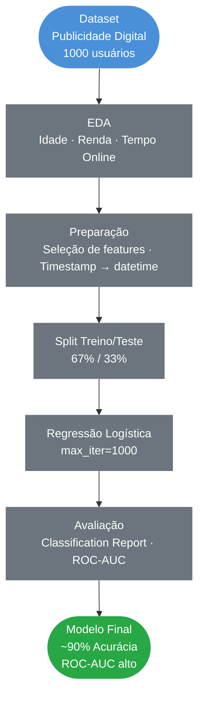

# Regressão Logística para Predição de Cliques em Anúncios

### EDA · Classificação · Regressão Logística · ROC-AUC · Marketing Digital

&nbsp;

[](https://www.python.org/)
[](https://pandas.pydata.org/)
[](https://scikit-learn.org/)
[](https://github.com/Anderson1999DC/Regressao-logistica-para-predicao-de-cliques)

&nbsp;
> Modelo de classificação para prever a probabilidade de um usuário clicar em um anúncio online,
> com base em características comportamentais e demográficas — atingindo ~90% de acurácia.

---

## Índice

- [Contexto](#contexto)
- [Objetivos](#objetivos)
- [Pipeline do Projeto](#pipeline-do-projeto)
- [Tecnologias](#tecnologias-utilizadas)
- [Dataset](#dataset)
- [Etapas Detalhadas](#etapas-detalhadas)
- [Resultados](#resultados)
- [Insights de Negócio](#insights-de-negócio)
- [Estrutura do Repositório](#estrutura-do-repositório)
- [Autor](#autor)

---

## Contexto

Projeto de Machine Learning aplicado ao marketing digital, utilizando um dataset fictício de publicidade online. O objetivo é identificar o perfil de usuários com maior probabilidade de interagir com anúncios, permitindo segmentação mais eficiente de campanhas publicitárias.

| Etapa | Descrição |
|---|---|
| **EDA** | Análise de perfil etário, renda regional e padrão de uso da internet |
| **Modelagem** | Regressão Logística para classificação binária |
| **Avaliação** | Acurácia, Precision, Recall, F1-Score e ROC-AUC |
| **Insight** | Identificação do perfil de usuário com maior propensão a clicar |

---

## Objetivos

- Construir um modelo de classificação para prever cliques em anúncios digitais
- Identificar variáveis comportamentais e demográficas que mais influenciam a decisão de clique
- Avaliar o modelo com métricas completas incluindo ROC-AUC e curva ROC
- Exportar o modelo treinado para deploy via API

---

## Pipeline do Projeto



---

## Tecnologias Utilizadas

| Tecnologia | Uso no Projeto |
|---|---|
|  | Linguagem principal |
|  | Manipulação e análise dos dados |
|  | Operações numéricas |
|  | Modelo, métricas e curva ROC |
|  | Curva ROC e visualizações |
|  | Análise exploratória e pairplot |

---

## Dataset

**Fonte:** Dataset fictício de publicidade digital criado para fins educacionais  
**Uso:** Exclusivamente educacional

| Característica | Detalhe |
|---|---|
| Volume | 1.000 usuários |
| Variável target | `Clicked on Ad` (1 = clicou) |
| Balanceamento | 50% clicou / 50% não clicou |

**Variáveis utilizadas no modelo:**

| Variável | Descrição |
|---|---|
| `Daily Time Spent on Site` | Tempo diário no site (min) |
| `Age` | Idade do usuário |
| `Area Income` | Renda média da região (USD) |
| `Daily Internet Usage` | Uso diário de internet (min) |
| `Male` | Sexo (1 = masculino) |

---

## Etapas Detalhadas

**Análise Exploratória de Dados (EDA)**
- Distribuição etária dos usuários pico entre 25 e 45 anos
- Relação entre idade e renda regional
- Relação entre tempo no site e uso diário de internet
- Pairplot segmentado por `Clicked on Ad` — revela padrões de separação entre as classes

**Preparação dos Dados**
- Conversão do campo `Timestamp` para formato `datetime`
- Remoção de colunas de texto sem valor preditivo (`Email`, `City`, `Country`, `Ad Topic Line`)
- Split treino/teste: **67% / 33%** com `random_state=42`

---

## Resultados

### Matriz de Confusão


### Curva ROC


| Métrica | Valor |
|---|---|
| **Acurácia** | **~90%** |
| **Precision (média)** | alto |
| **Recall (média)** | alto |
| **F1-Score (média)** | alto |
| **ROC-AUC** | alto |

> Bom equilíbrio entre Precision e Recall para ambas as classes o modelo identifica de forma consistente tanto usuários propensos a clicar quanto aqueles que não clicariam.

---

## Insights de Negócio

**Perfil de usuário com maior probabilidade de clique:**
- Menor tempo diário no site usuários em busca ativa, não passivos
- Menor uso diário de internet menos expostos a ruído digital
- Faixa etária mais elevada
- Renda regional moderada

**Aplicações práticas:**
- Segmentação de audiência para campanhas de anúncios digitais
- Redução do custo por clique (CPC) ao evitar usuários com baixa propensão
- Score de propensão integrável em plataformas de ad bidding
- Base para sistemas de recomendação de conteúdo patrocinado

**Limitações do modelo:**
- Dataset fictício e simplificado em produção, variáveis como histórico de cliques e categoria do anúncio seriam essenciais
- Avaliado em conjunto de dados único desempenho pode variar em outros contextos

---

## Estrutura do Repositório

```
Regressao-logistica-para-predicao-de-cliques/
│
├──  assets/                                      # Gráficos gerados na análise
│   ├── confusion_matrix_clique.png
│   └── roc_clique.png
│
├──  regressao_logistica_predicao_de_clique.ipynb # Notebook completo
├──  advertising.csv                              # Dataset original
├──  modelo_predicao_clique.pkl                   # Modelo treinado
├──  colunas_clique.pkl                           # Features esperadas pela API
├──  requirements.txt                             # Dependências do projeto
└──  README.md                                    # Documentação do projeto
```

---

## Autor

<div align="center">


**Anderson Coelho**
*Cientista de Dados*

[](https://www.linkedin.com/in/anderson-coelho-42671634a/)
[](https://github.com/Anderson1999DC)

</div>

---

<div align="center">

</div>
