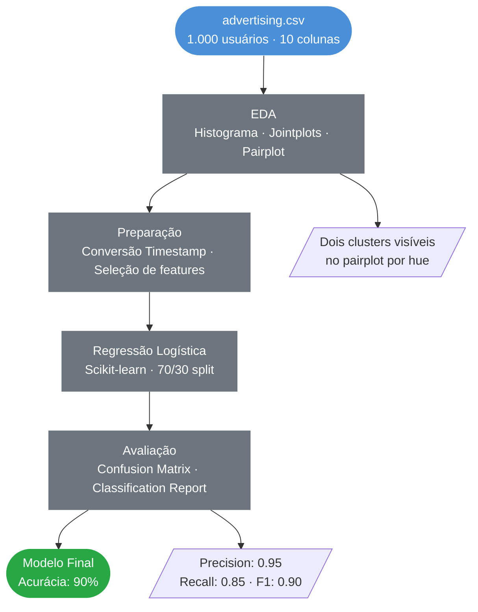
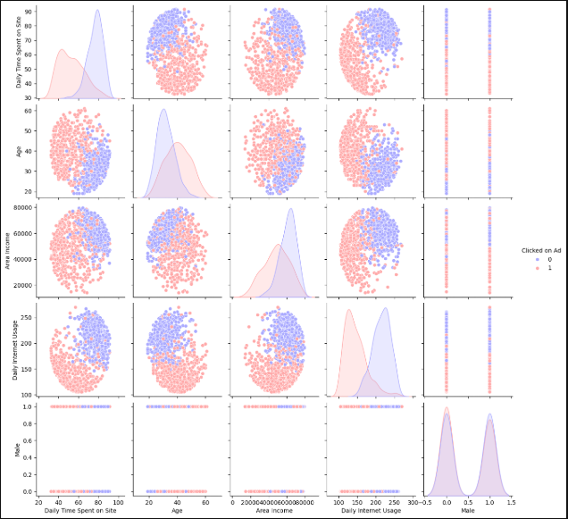
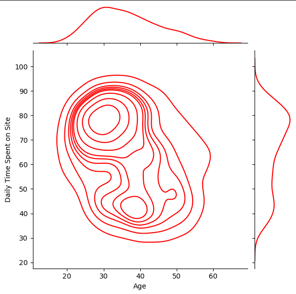
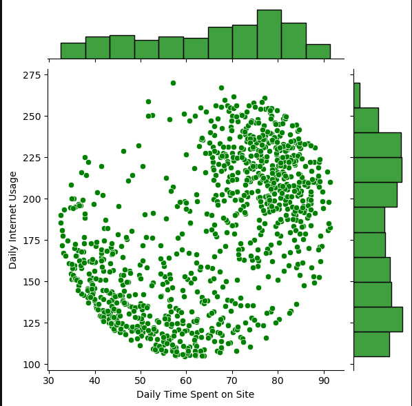

<div align="center">

# Regressão Logística para Predição de Cliques em Anúncios
### EDA · Classificação Binária · Regressão Logística · Marketing Digital

<br>

[](https://www.python.org/)
[](https://pandas.pydata.org/)
[](https://scikit-learn.org/)
[](https://seaborn.pydata.org/)
[]()

<br>

> Modelo de classificação binária para prever se um usuário irá clicar em um anúncio online,
> com base em dados comportamentais e demográficos — aplicação direta em estratégias de marketing digital.

</div>

---

## Índice

- [Contexto](#contexto)
- [Objetivos](#objetivos)
- [Pipeline do Projeto](#pipeline-do-projeto)
- [Tecnologias](#tecnologias-utilizadas)
- [Dataset](#dataset)
- [Análise Exploratória](#análise-exploratória)
- [Modelagem e Resultados](#modelagem-e-resultados)
- [Insights de Negócio](#insights-de-negócio)
- [Estrutura do Repositório](#estrutura-do-repositório)
- [Autor](#autor)

---

## Contexto

Empresas que investem em **marketing digital** precisam entender quais usuários têm maior probabilidade de interagir com anúncios. Direcionar campanhas sem critério gera desperdício de verba e baixo retorno.

A partir de dados comportamentais e demográficos de 1.000 usuários, o objetivo é construir um modelo capaz de **prever a probabilidade de clique em anúncios**, permitindo segmentação mais inteligente das campanhas.

| Classe | Descrição |
|---|---|
| `0` | Usuário **não clicou** no anúncio |
| `1` | Usuário **clicou** no anúncio |

---

## Objetivos

- Explorar padrões comportamentais que diferenciam usuários que clicam ou não em anúncios
- Identificar as variáveis mais relevantes para a classificação
- Construir e avaliar um modelo de Regressão Logística para classificação binária
- Traduzir os resultados em recomendações para estratégias de marketing digital

---

## Pipeline do Projeto



---

## Tecnologias Utilizadas

| Tecnologia | Uso no Projeto |
|---|---|
|  | Linguagem principal |
|  | Manipulação e análise dos dados |
|  | Operações numéricas |
|  | Histograma de distribuição |
|  | Jointplots e pairplot com hue |
|  | Modelo de Regressão Logística e métricas |

---

## Dataset

**Fonte:** `advertising.csv` — Dataset fictício de publicidade online
**Uso:** Exclusivamente educacional

| Característica | Detalhe |
|---|---|
| Volume | 1.000 usuários |
| Colunas totais | 10 |
| Features usadas no modelo | 5 |
| Variável alvo | `Clicked on Ad` (0 ou 1) |
| Classes | Balanceadas (~50% / 50%) |

**Variáveis do modelo:**

| Feature | Descrição | Média |
|---|---|---|
| `Daily Time Spent on Site` | Tempo diário no site (min) | 65,0 min |
| `Age` | Idade do usuário | 36,0 anos |
| `Area Income` | Renda média da região (US$) | US$ 55.000 |
| `Daily Internet Usage` | Uso diário de internet (min) | 180 |
| `Male` | Gênero (binária: 0/1) | — |
| `Clicked on Ad` | **Variável alvo** — clicou (1) ou não (0) | — |

---

## Análise Exploratória

### Visão Geral — Separação por Comportamento de Clique



> O pairplot com `hue="Clicked on Ad"` revela **dois clusters bem definidos** — usuários que clicam (vermelho) e os que não clicam (azul) se separam claramente em `Daily Time Spent on Site` e `Daily Internet Usage`. Essa separação visual confirma que o modelo terá base sólida para classificar.

---

### Idade × Tempo no Site (KDE)



> Usuários **mais velhos e com menos tempo no site** formam o cluster com maior probabilidade de clicar. Já os usuários mais jovens e com alto tempo no site tendem a **não clicar** — possivelmente mais experientes em ignorar anúncios.

---

### Tempo no Site × Uso Diário de Internet



> Dois grupos distintos: usuários com **alto uso de internet e alto tempo no site** raramente clicam; usuários com **baixo uso de internet e menos tempo no site** clicam mais. Padrão consistente com o perfil de um usuário menos habituado ao ambiente digital.

---

## Modelagem e Resultados

### Métricas de Avaliação

| Métrica | Classe 0 (não clicou) | Classe 1 (clicou) | Média |
|---|---|---|---|
| **Precision** | 0.86 | **0.95** | 0.91 |
| **Recall** | **0.96** | 0.85 | 0.90 |
| **F1-score** | 0.91 | 0.90 | 0.90 |
| **Accuracy** | — | — | **90%** |

### Matriz de Confusão

```
                  Previsto: 0    Previsto: 1
Real: 0 (não clicou)   155            7
Real: 1 (clicou)        25          143
```

> O modelo acertou **155 de 162 não-clicadores** (96% de recall) e **143 de 168 clicadores** (85% de recall). Os 25 falsos negativos representam usuários que clicaram mas não foram identificados pelo modelo — erro aceitável para um primeiro modelo de baseline.

---

## Insights de Negócio

- **Usuários mais velhos com menor uso de internet** têm maior probabilidade de clicar — segmentar campanhas para esse perfil tende a aumentar o CTR
- **Alto tempo no site e alto uso de internet** são indicadores negativos de clique — usuários digitalmente experientes ignoram mais anúncios
- O modelo com **90% de acurácia** permite automatizar a segmentação de público-alvo, reduzindo desperdício de verba em campanhas

### Próximos Passos Sugeridos

- Testar outros algoritmos de classificação (Random Forest, XGBoost) para comparação
- Incluir variáveis de localização (`Country`) via encoding para capturar padrões geográficos
- Aplicar `max_iter` maior no modelo ou normalização de dados para resolver o aviso de convergência
- Implementar uma curva ROC-AUC para avaliar o threshold ideal de classificação

---

## Estrutura do Repositório

```
Regressao-logistica-para-predicao-de-cliques/
│
├── 📁 Assets/                                      # Gráficos gerados na análise
│   ├── pairplot_clicked_on_ad.png
│   ├── kde_idade_tempo_site.png
│   └── jointplot_tempo_site_internet.png
│
├── 📓 regressao_logistica_predicao_de_clique.ipynb  # Notebook completo
├── 📄 advertising.csv                               # Dataset
├── 📄 requirements.txt                              # Dependências do projeto
└── 📄 README.md                                     # Documentação do projeto
```

---

## Autor

<div align="center">


**Anderson Coelho**
*Cientista de Dados*

[](https://www.linkedin.com/in/anderson-coelho-42671634a/)
[](https://github.com/Anderson1999DC)

</div>

---

<div align="center">

</div>
