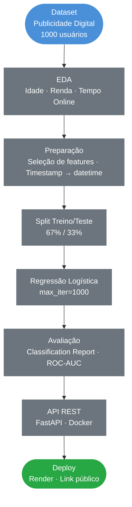
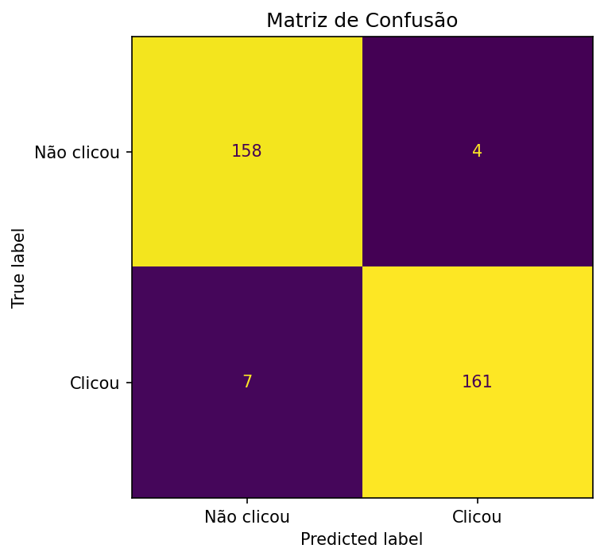
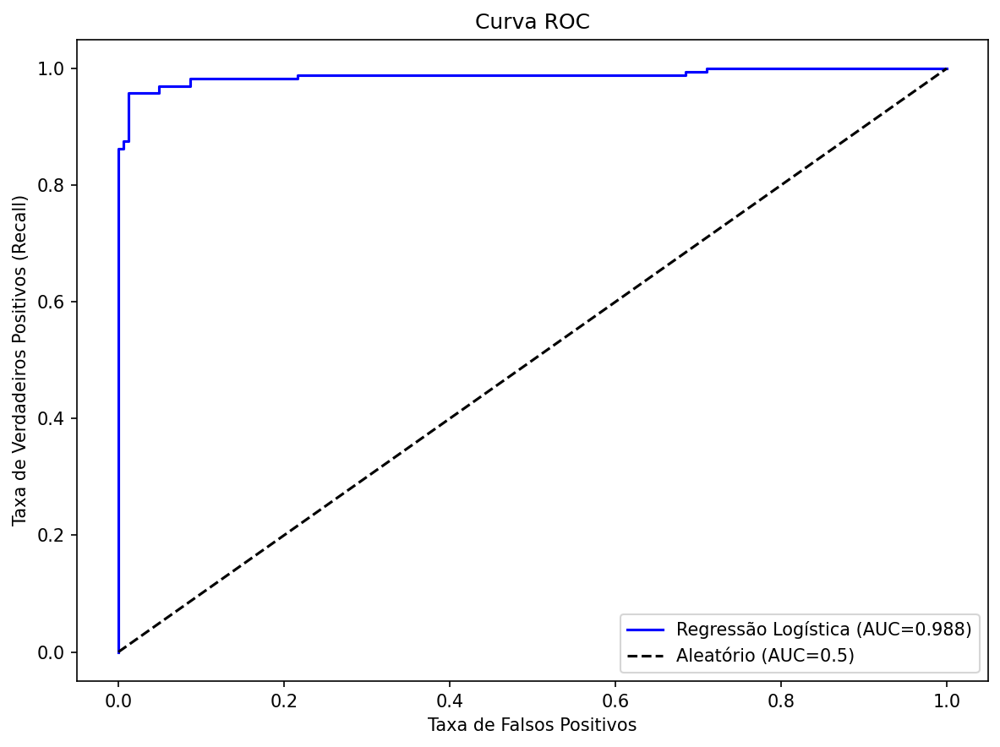
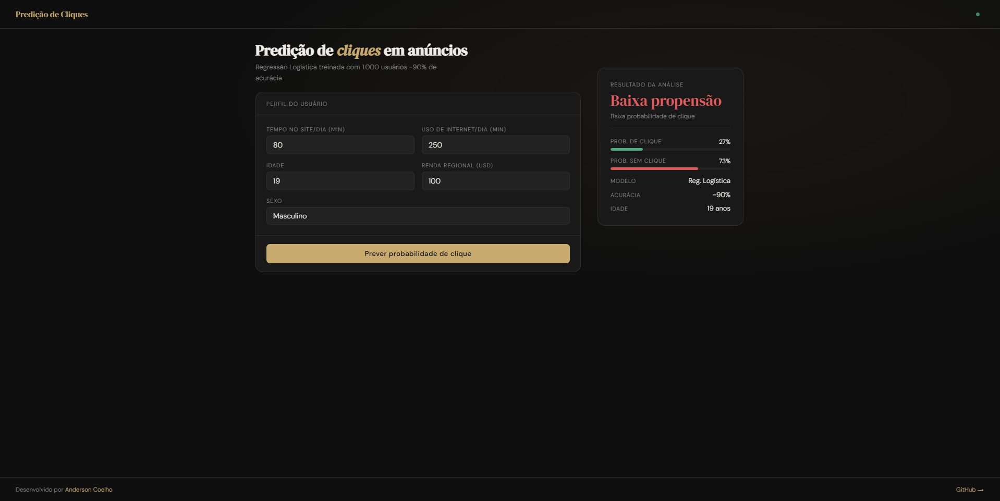
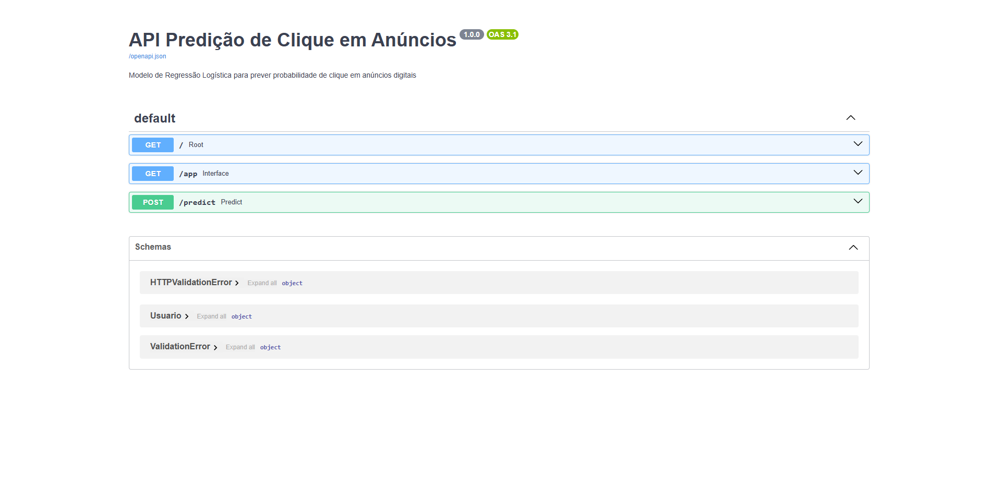

# Regressão Logística para Predição de Cliques em Anúncios

### EDA · Classificação · Regressão Logística · ROC-AUC · FastAPI · Docker · Deploy

&nbsp;

[](https://www.python.org/)
[](https://scikit-learn.org/)
[](https://fastapi.tiangolo.com/)
[](https://www.docker.com/)
[](https://api-predicao-clique.onrender.com)

&nbsp;
> Modelo de classificação para prever a probabilidade de um usuário clicar em um anúncio online,
> com base em características comportamentais e demográficas atingindo ~90% de acurácia.
> Deploy em produção com API REST containerizada.

&nbsp;

**[Acessar interface interativa](https://api-predicao-clique.onrender.com/app)** &nbsp;|&nbsp; **[Documentação da API](https://api-predicao-clique.onrender.com/docs)**

---

## Índice

- [Contexto](#contexto)
- [Objetivos](#objetivos)
- [Pipeline do Projeto](#pipeline-do-projeto)
- [Tecnologias](#tecnologias-utilizadas)
- [Dataset](#dataset)
- [Análise Exploratória](#análise-exploratória)
- [Resultados](#resultados)
- [Insights de Negócio](#insights-de-negócio)
- [API em Produção](#api-em-produção)
- [Estrutura do Repositório](#estrutura-do-repositório)
- [Autor](#autor)

---

## Contexto

Projeto de Machine Learning aplicado ao marketing digital, utilizando um dataset fictício de publicidade online. O objetivo é identificar o perfil de usuários com maior probabilidade de interagir com anúncios, permitindo segmentação mais eficiente de campanhas publicitárias. O modelo foi colocado em produção como API REST containerizada.

| Etapa | Descrição |
|---|---|
| **EDA** | Análise de perfil etário, renda regional e padrão de uso da internet |
| **Modelagem** | Regressão Logística para classificação binária |
| **Avaliação** | Acurácia, Precision, Recall, F1-Score e ROC-AUC |
| **Deploy** | API REST com FastAPI + Docker + Render |

---

## Objetivos

- Construir um modelo de classificação para prever cliques em anúncios digitais
- Identificar variáveis comportamentais e demográficas que mais influenciam a decisão de clique
- Avaliar o modelo com métricas completas incluindo ROC-AUC e curva ROC
- Criar uma API REST com FastAPI e containerizar com Docker
- Fazer deploy em produção com link público acessível

---

## Pipeline do Projeto



---

## Tecnologias Utilizadas

| Tecnologia | Uso no Projeto |
|---|---|
|  | Linguagem principal |
|  | Manipulação e análise dos dados |
|  | Operações numéricas |
|  | Modelo, métricas e curva ROC |
|  | Curva ROC e visualizações |
|  | Análise exploratória e pairplot |
|  | API REST para servir o modelo em produção |
|  | Containerização da aplicação |
|  | Hospedagem do deploy em produção |

---

## Dataset

**Fonte:** Dataset fictício de publicidade digital criado para fins educacionais
**Uso:** Exclusivamente educacional

| Característica | Detalhe |
|---|---|
| Volume | 1.000 usuários |
| Variável target | `Clicked on Ad` (1 = clicou) |
| Balanceamento | 50% clicou / 50% não clicou |

**Variáveis utilizadas no modelo:**

| Variável | Descrição |
|---|---|
| `Daily Time Spent on Site` | Tempo diário no site (min) |
| `Age` | Idade do usuário |
| `Area Income` | Renda média da região (USD) |
| `Daily Internet Usage` | Uso diário de internet (min) |
| `Male` | Sexo (1 = masculino) |

---

## Análise Exploratória

### Matriz de Confusão



> Bom equilíbrio entre verdadeiros positivos e negativos o modelo identifica de forma consistente tanto usuários propensos a clicar quanto aqueles que não clicariam.

### Curva ROC



> ROC-AUC elevado indica forte capacidade do modelo de separar as duas classes usuários que clicam e usuários que não clicam em anúncios.

---

## Resultados

| Métrica | Valor |
|---|---|
| **Acurácia** | **~90%** |
| **Precision (média)** | alto |
| **Recall (média)** | alto |
| **F1-Score (média)** | alto |
| **ROC-AUC** | alto |

> Bom equilíbrio entre Precision e Recall para ambas as classes o modelo identifica de forma consistente tanto usuários propensos a clicar quanto aqueles que não clicariam.

---

## Insights de Negócio

**Perfil de usuário com maior probabilidade de clique:**
- Menor tempo diário no site usuários em busca ativa, não passivos
- Menor uso diário de internet menos expostos a ruído digital
- Faixa etária mais elevada
- Renda regional moderada

**Aplicações práticas:**
- Segmentação de audiência para campanhas de anúncios digitais
- Redução do custo por clique (CPC) ao evitar usuários com baixa propensão
- Score de propensão integrável em plataformas de ad bidding
- Base para sistemas de recomendação de conteúdo patrocinado

**Limitações do modelo:**
- Dataset fictício e simplificado em produção, variáveis como histórico de cliques e categoria do anúncio seriam essenciais
- Avaliado em conjunto de dados único desempenho pode variar em outros contextos

---

## API em Produção

### Interface Interativa

[](https://api-predicao-clique.onrender.com/app)

> Acesse a interface em: **[api-predicao-clique.onrender.com/app](https://api-predicao-clique.onrender.com/app)**

### Documentação Swagger

[](https://api-predicao-clique.onrender.com/docs)

> Documentação completa da API em: **[api-predicao-clique.onrender.com/docs](https://api-predicao-clique.onrender.com/docs)**

### Exemplo de Requisição

```bash
curl -X POST https://api-predicao-clique.onrender.com/predict \
  -H "Content-Type: application/json" \
  -d '{
    "daily_time_spent_on_site": 50.0,
    "age": 35,
    "area_income": 55000.0,
    "daily_internet_usage": 180.0,
    "male": 0
  }'
```

### Resposta

```json
{
  "clicou": 1,
  "resultado": "Alta probabilidade de clique",
  "probabilidade_clique": 0.8234,
  "probabilidade_nao_clique": 0.1766,
  "modelo": "LogisticRegression"
}
```

### Endpoints disponíveis

| Método | Endpoint | Descrição |
|---|---|---|
| `GET` | `/` | Status da API |
| `GET` | `/app` | Interface interativa |
| `GET` | `/docs` | Documentação Swagger |
| `POST` | `/predict` | Predição de clique |

---

## Estrutura do Repositório

```
Regressao-logistica-para-predicao-de-cliques/
│
├──  Assets/                                          # Gráficos e imagens
│   ├── confusion_matrix_clique.png
│   ├── roc_clique.png
│   ├── interface.png
│   └── Swagger.png
│
├──  regressao_logistica_predicao_de_clique.ipynb    # Notebook completo
├──  main.py                                          # API FastAPI
├──  index.html                                       # Interface interativa
├──  Dockerfile                                       # Containerização
├──  modelo_predicao_clique.pkl                       # Modelo treinado
├──  colunas_clique.pkl                               # Features esperadas pela API
├──  advertising.csv                                  # Dataset original
├──  requirements.txt                                 # Dependências do projeto
└──  README.md                                        # Documentação do projeto
```

---

## Autor

<div align="center">


**Anderson Coelho**
*Cientista de Dados*

[](https://www.linkedin.com/in/anderson-coelho-42671634a/)
[](https://github.com/Anderson1999DC)

</div>

---

<div align="center">
